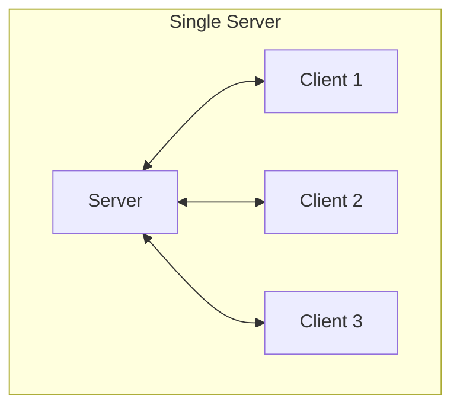
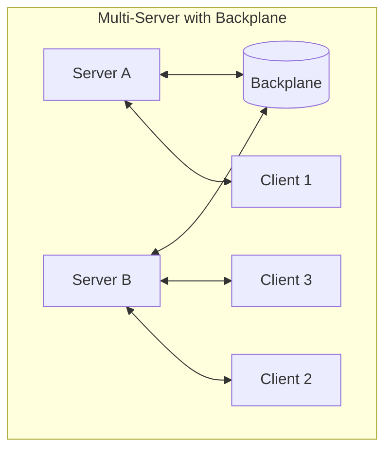
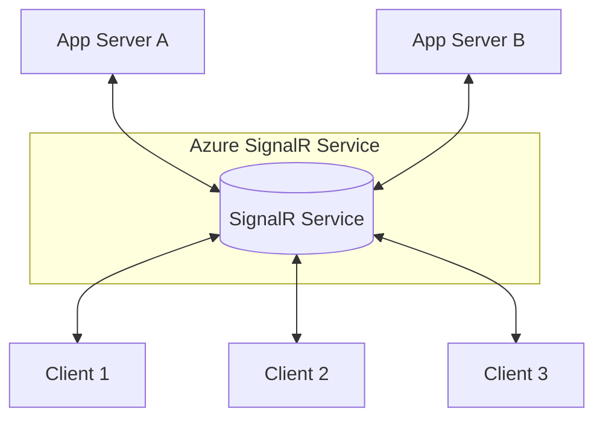

# SignalR Single Server vs Multi-Server

---

## SignalR Single Server

- **Setup:** SignalR runs on a single server instance.
- **How it works:** All clients connect to that one server.
- **Pros:**
  - Simple to set up and maintain.
  - Works well for small-scale apps or development.
- **Cons:**
  - Scalability is limited — only as powerful as one server.
  - If the server goes down, all connections drop.
  - No built-in way to share client connection state if you have multiple server instances.

---

## SignalR Multi-Server (Scaling Out)

- **Setup:** SignalR runs on multiple servers (a server farm or cloud instances).
- **How it works:** Clients connect to different servers, but the servers must coordinate to share messages and connection info.
- **Challenge:** SignalR uses in-memory connection state, which is local to each server. So without coordination, messages sent to one server won’t reach clients connected to another.
- **Solution:** Use a **backplane** or **distributed messaging system** to coordinate servers:
  - **Redis backplane**
  - **Azure SignalR Service** (a fully managed backplane for scaling)
  - **SQL Server backplane** (less common now)
- **Pros:**
  - Can handle a large number of clients.
  - Fault-tolerant; if one server fails, others continue.
- **Cons:**
  - More complex setup.
  - Backplane adds latency and operational overhead.

---

## When to Use Which?

- **Single server:** Small apps, dev/testing, or low traffic.
- **Multi-server:** Production apps with high concurrency and reliability requirements.

---

## Mermaid Diagrams

### Single Server

---

### Multi-Server with Backplane

---

### Azure SignalR Service

