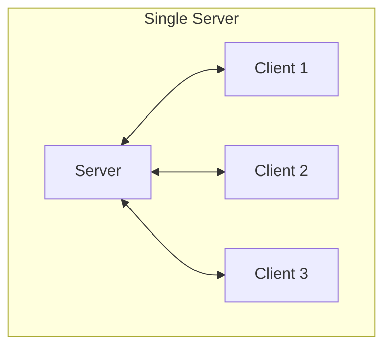
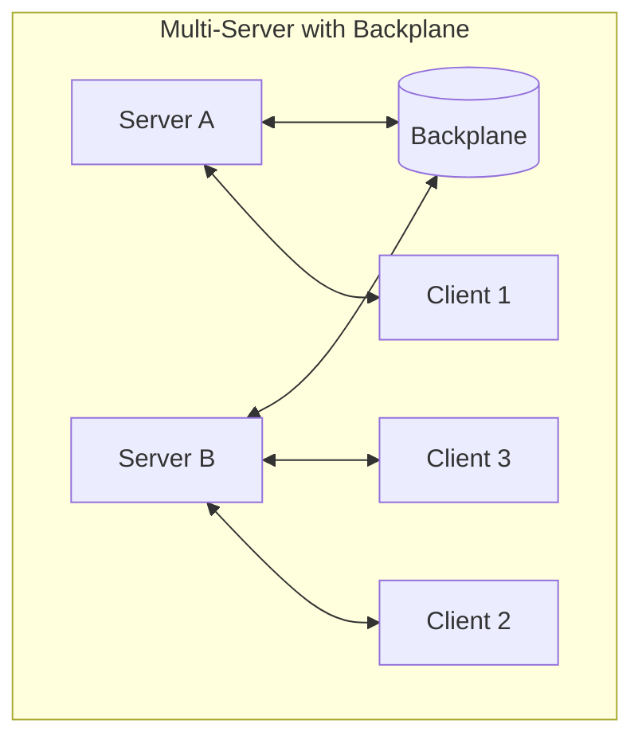
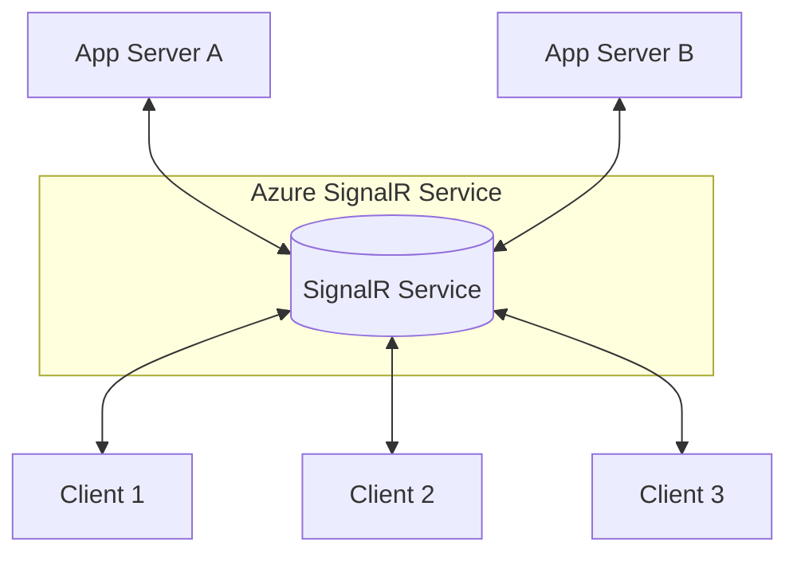

# SignalR Deployment Models

## Differences

| Aspect                | Single Server                                   | Multi-Server (with Backplane)                           | Azure SignalR Service                          |
|------------------------|------------------------------------------------|---------------------------------------------------------|------------------------------------------------|
| **Architecture**       | One server handles all client connections.     | Multiple servers share load, coordinated by a backplane.| Azure manages all client connections; servers just push events. |
| **Connection Storage** | Connections kept in server memory.             | Connections distributed across servers, synced via backplane. | Connections offloaded to Azure service. |
| **Scalability**        | Limited to capacity of one server.             | Horizontally scalable with multiple servers.            | Virtually unlimited scalability (cloud managed). |
| **Fault Tolerance**    | Single point of failure.                       | Redundant — if one server dies, others handle traffic.  | High availability built into Azure service. |
| **Performance**        | Very fast (direct memory lookups).             | Slight latency overhead due to backplane communication. | Slight overhead, but optimized by Azure infra. |
| **Setup Complexity**   | Simple, no extra infrastructure.               | More complex, requires Redis/Azure backplane.           | Easiest in cloud — Azure handles infra. |
| **Best Use Case**      | Small apps, dev, POC.                          | Production apps with many concurrent users.             | Enterprise-grade, cloud-native, millions of clients. |

---

## Mermaid Diagrams

### Single Server

---

### Multi-Server with Backplane

---

### Azure SignalR Service

